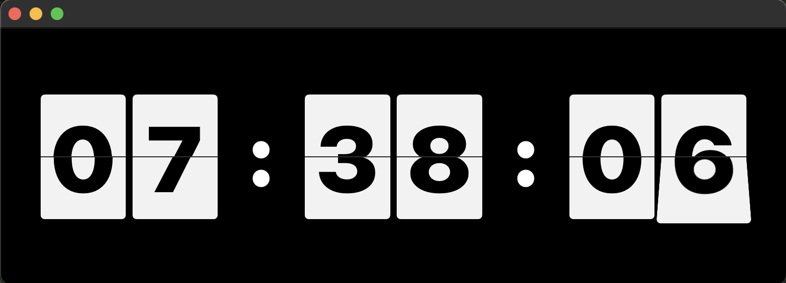
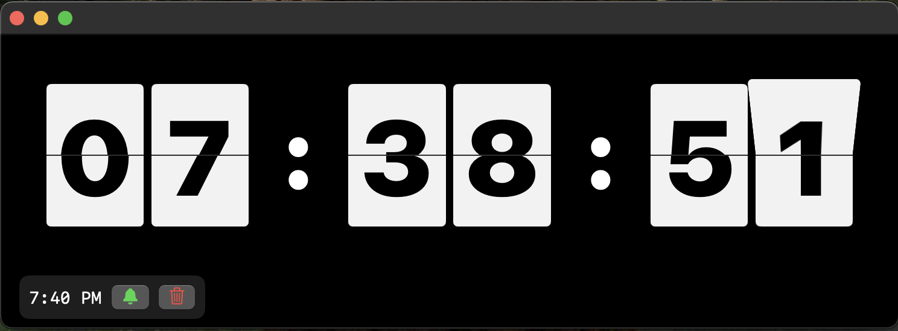
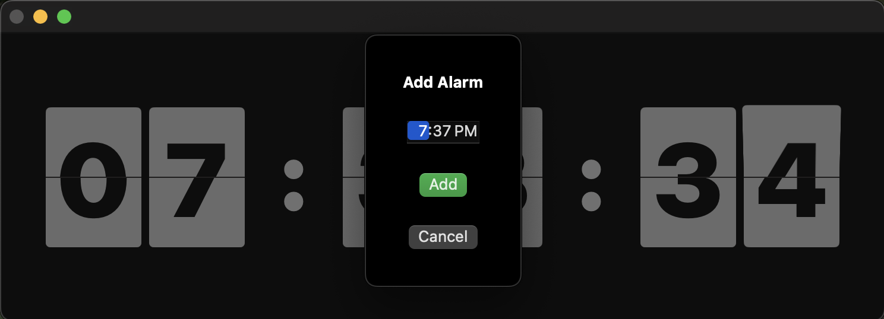

# Flip Clock for macOS

A beautiful, resizable, retro-inspired flip clock app for macOS, built with SwiftUI. The app features smooth flip animations, a fully responsive UI, and a built-in alarm system with retro beep sounds.

---

## Features

- **Retro Flip Animation:**
  - Digits flip smoothly, mimicking classic mechanical flip clocks.
- **Fully Responsive:**
  - The clock resizes dynamically to fit any window size or aspect ratio.
- **Dark Mode by Default:**
  - The app always launches in dark mode for a classic look.
- **Seamless Black UI:**
  - The entire window, including the title bar, is black for a distraction-free experience.
- **Alarm Support:**
  - Click anywhere on the clock to add a new alarm.
  - Add multiple alarms, enable/disable, and delete them easily.
  - Alarms trigger a retro-style beep sound.
- **Live Updating Dock Icon:**
  - The app icon in the Dock automatically updates every minute to show the current time in a retro flip clock style.

---

## Screenshots

**Main Window**

**With Alarm**

**Set Alarm**

---

## How to Use

1. **Run the app.**
2. **Resize** the window to your liking—the clock and digits will always fit perfectly.
3. **Add alarms** by clicking anywhere on the clock display. Set the time and save.
4. **Manage alarms** in the horizontal list below the clock. Enable/disable or delete as needed.
5. When an alarm goes off, you'll hear a retro beep sound.

---

## Code Structure & Explanation

- **SwiftUI-Based:**
  - The UI is built using SwiftUI for declarative, modern, and responsive design.
- **Key Files:**
  - `ContentView.swift`: Main entry point, manages layout, alarm sheet, and window appearance.
  - `ClockView.swift`: Contains the flip clock layout and handles responsive sizing.
  - `FlipView.swift` & `SingleFlipView.swift`: Implement the flip animation for each digit.
  - `AlarmManager.swift`: ObservableObject managing alarms, persistence, and sound playback.
  - `AppWindowAccessor.swift`: Allows customization of the NSWindow (title bar, background, etc).
  - `Color+Flip.swift`: Centralizes color definitions for easy theme changes.
  - `FlipClockDockIconRenderer` & `AppDelegate`: Handle drawing and updating the Dock icon to reflect the current time, syncing precisely with each new minute.
  - `retro_beep.wav`: The retro alarm sound (replaceable with any WAV file).
- **Alarm Logic:**
  - Alarms are stored in UserDefaults for persistence.
  - When the system time matches an enabled alarm, the sound plays and the alarm auto-disables.
- **Customization:**
  - All colors and fonts are easily adjustable in `Color+Flip.swift` and the relevant views.
  - The app enforces dark mode and a seamless black UI.

---

## App Icon

The app icon is provided in multiple resolutions for macOS, including 128x128. You can find these in `Assets.xcassets/AppIcon.appiconset/`:

- 16x16, 32x32, 128x128, 256x256, 512x512 (and @2x retina versions)
- To update the icon, replace `flip-clock.png` (or your source PNG) and regenerate the icons using the provided script/commands.

---

## Additional Features & Changes

- **12-Hour Format:** The clock and Dock icon both use a 12-hour time format for display.
- **Rounded Dock Icon:** The live-updating Dock icon features a rounded rectangle background for a modern look.
- **Default Icon:** A default static icon (`clock_default.png`) is shown in the Dock before the first dynamic update.
- **Draggable Window:** The window remains draggable, even with a custom black title bar and hidden controls.
- **Dark Mode:** The app enforces dark mode by default, regardless of system settings.
- **Alarm UI:** Click the clock itself to add alarms—no separate button needed.
- **Icon Generation:** Instructions and automation for generating all required icon sizes from a single PNG are provided.

---

## Requirements

- macOS 12.0+
- Xcode 14+

---

## Customization & Extensibility

- **Change Alarm Sound:**
  - Replace `retro_beep.wav` in the project directory with your own WAV file.
- **Digit Colors:**
  - Edit `Color+Flip.swift` to change digit or background colors.
- **Add Features:**
  - The modular codebase makes it easy to add features like AM/PM display, snooze, or custom themes.

---

## Credits
- Retro beep sound from [freesound.org](https://freesound.org/people/Soundholder/sounds/425331/) (Creative Commons 0).

---

## License
MIT License
