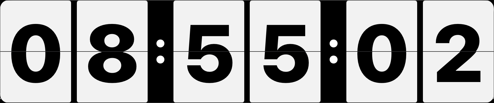
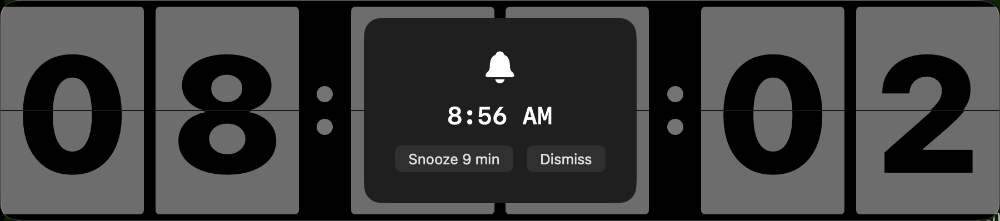
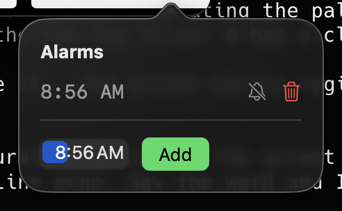

# Flip Clock for macOS



A retro-inspired flip clock for macOS, built with SwiftUI. The digits bleed to the edges of the
window at any size, the Dock icon tracks the wall clock to the minute, and alarms live behind a
control that stays out of the way until you reach for it.

---

## Features

- **Edge-to-edge digits.** The clock is sized from its own geometry, so it fills the constraining
  axis exactly — no margin, no clipping. `⌘=` snaps the window to the clock's aspect ratio so it
  bleeds on all four sides at once.
- **Retro flip animation.** Each card splits across the middle and falls, as a mechanical flip
  clock does.
- **Minute-accurate Dock icon.** The icon redraws on the wall-clock minute and re-syncs after
  sleep/wake, a timezone change, or a system clock correction.
- **Alarms.** Add with `⌘N` or the bell that appears on hover. Enable, disable, or delete them from
  the popover. A ringing alarm can be snoozed or dismissed.
- **Chrome that gets out of the way.** Window buttons and the bell fade out when the pointer
  leaves, leaving only the clock. The window drags from anywhere.
- **Seconds toggle** (`⌘S`) and **always on top** (`⌘T`), both remembered between launches.

## Screenshots

**Alarm ringing**



**Managing alarms**



---

## Keyboard shortcuts

| Shortcut | Action |
|---|---|
| `⌘N` | New alarm (opens the alarm popover) |
| `⌘=` | Fit the window to the clock's aspect ratio |
| `⌘S` | Show/hide seconds |
| `⌘T` | Always on top |
| `Esc` | Silence a ringing alarm |

The same items are available from the **Clock** menu and from a right-click on the clock face.

---

## How to Use

1. **Run the app.** Resize the window however you like — the clock always fills it.
2. Press **`⌘=`** to snap the window to the clock's exact proportions for a perfect edge-to-edge fit.
3. **Add alarms** with `⌘N`, or move the pointer over the window and click the bell in the corner.
4. When an alarm goes off, the clock dims and a banner offers **Snooze** or **Dismiss**. An
   untouched alarm silences itself after a minute. Alarms disable themselves once they have fired.

---

## Requirements

- macOS 15.4+
- Xcode 16+

## Build and test

```bash
xcodebuild -project flip-clock.xcodeproj -scheme flip-clock -configuration Debug build
xcodebuild -project flip-clock.xcodeproj -scheme flip-clock test -only-testing:flip-clockTests
```

`./release.sh` builds the Release configuration, installs the app to `/Applications`, and writes a
distributable disk image to `release/`. It needs [`create-dmg`](https://github.com/create-dmg/create-dmg)
(`brew install create-dmg`) for the disk image step.

---

## Code Structure

- `FlipMetrics.swift` — the clock's geometry, expressed in multiples of the font size, and the fit
  math that turns a window size into a font size. Single source of truth: the views lay out from
  these same constants, so the sizing math cannot drift from what is drawn.
- `TimeTicker.swift` — a timer that fires on true wall-clock boundaries and re-arms itself after
  every tick, runs in the `.common` run-loop mode (so it keeps ticking during a window resize or
  drag), and re-syncs on wake and clock changes. The clock, the Dock icon, and the alarm check each
  own one.
- `ClockView.swift` / `ClockViewModel.swift` — the digit row and the once-per-second fan-out into
  six `FlipViewModel`s.
- `FlipView.swift` / `SingleFlipView.swift` — the flip animation. A card is drawn whole and then
  cropped to its top or bottom half, which is what keeps a digit in register across the split.
- `AlarmManager.swift` — alarm storage (`UserDefaults`), matching, sound, ringing state, snooze.
- `AppSettings.swift` — persisted preferences (seconds, always on top).
- `ContentView.swift` — layout, hover chrome, alarm popover, ringing banner, window configuration.
- `AppWindowAccessor.swift` — hands the hosting `NSWindow` back to SwiftUI so window chrome can be
  driven from view state.
- `flip_clockApp.swift` — app entry point, menu commands, and the Dock icon renderer.
- `retro_beep.wav` — the alarm sound (replaceable with any WAV file).

---

## Customization

- **Alarm sound:** replace `retro_beep.wav`.
- **Colors:** edit `Color+Flip.swift` (`textColor`, `flipBackground`, `separator`).
- **Proportions:** edit `FlipMetrics.swift` — card size, spacing, and colon dots are all defined
  there, and the layout follows automatically.

---

## App Icon

Icons live in `Assets.xcassets/AppIcon.appiconset/` at 16×16 through 512×512 (plus @2x). The Dock
icon is drawn at runtime from the current time; the asset-catalog icon is what other surfaces show.

---

## Credits
- Retro beep sound from [freesound.org](https://freesound.org/people/Soundholder/sounds/425331/) (Creative Commons 0).

## License
MIT License
